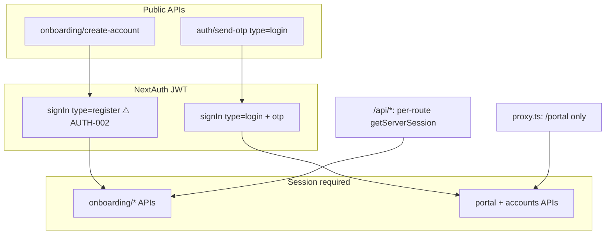

# Authentication & login — tracked issues

**Branch:** `feat/onboarding-flow-mock`  
**Recorded:** 2026-05-19 (initial), **2026-05-19** (post-OTP-login consolidation review)  
**Source:** Login flow audit; full auth/onboarding orchestration review  
**Scope:** `src/lib/auth.ts`, `src/app/login/`, `src/app/api/auth/*`, `src/app/api/onboarding/create-account/`, `src/proxy.ts`, `src/lib/otp.ts`, `src/lib/admin-auth.ts`, `src/lib/csrf.ts`

**Related:** [onboarding-issues.md](./onboarding-issues.md) (KYC, progress, ONB-023, ONB-041)

**Status legend:** `open` | `in_progress` | `done` | `wontfix`

---

## Summary (open items)

| Severity | Open | Next sprint focus |
|----------|------|-------------------|
| critical | 0 | — (AUTH-001/002/003 done 2026-05-20) |
| high     | 0 | — (AUTH-006/014/015 done 2026-05-20) |
| medium   | 1 | AUTH-022 (Upstash — documented) |
| low      | 0 | — |

_Product decision (2026-05-19):_ **portal login is phone + SMS OTP only.** Password UI removed; password APIs and `authorize` branches remain until AUTH-013 / AUTH-021.

---

## Architecture — how auth is orchestrated

| Layer | Responsibility | Gap |
|-------|----------------|-----|
| **Browser** | `/onboarding` wizard; `/login` phone → OTP | T1 uses `signIn(register)` without re-proving OTP |
| **NextAuth** | JWT 30d; `authorize` supports login OTP, password, register | Password/register paths still callable (AUTH-002, AUTH-021) |
| **Proxy** | Redirect unauthenticated `/portal`; CSP headers; CSRF on **pages** only | `/api` excluded from matcher (AUTH-006) |
| **Public APIs** | `create-account`, `send-otp` | Enumeration + no verify rate limit (AUTH-004, AUTH-007) |
| **Legacy** | `verify-and-create-account`, `/api/auth/login`, forgot-password | Duplicate pipelines (AUTH-013) |

---

## Critical (open)

### AUTH-001 — Password reset API does not require OTP proof
- **Status:** done
- **Area:** security
- **Files:** `src/app/api/auth/reset-password/route.ts`, `src/app/forgot-password/`
- **Problem:** `POST /api/auth/reset-password` accepts `email` or `phone` + `newPassword` only. UI may call `verify-otp` first, but the API does not check a reset token or recent OTP verification.
- **Impact:** Account takeover via direct API call without OTP.
- **Acceptance:** Reset only after verified OTP (single-use token from `verify-otp`), or remove endpoint if product stays OTP-only (AUTH-021).
- **Sprint:** P0 — block or remove with OTP-only decision.
- **Resolution (2026-05-20):** `POST` returns `410`; OTP-only login.

### AUTH-002 — `signIn({ type: 'register' })` bypasses OTP re-verification
- **Status:** done
- **Area:** security
- **Files:** `src/lib/auth.ts`, `src/app/onboarding/page.tsx`
- **Problem:** After onboarding T1, client calls `signIn('credentials', { phone, type: 'register' })`. `authorize` only checks user exists and `userAccount.count >= 2` — no OTP or password.
- **Impact:** Anyone who knows a user’s phone can obtain a 30-day JWT after account creation.
- **Acceptance:** Issue one-time server token from `create-account` (httpOnly cookie or signed JWT ≤5 min); exchange once for session; remove or harden `type: 'register'`.
- **Sprint:** P0 — first implementation task.
- **Resolution (2026-05-20):** `issuePostSignupToken` from `create-account`; `signIn(type: post_signup)`; `register` rejected.

### AUTH-003 — Setup password by raw `userId` without auth
- **Status:** done
- **Area:** security
- **Files:** `src/app/api/auth/setup-password/route.ts`, `src/app/setup-password/`
- **Problem:** `POST` accepts `{ userId, password }` with no session, OTP, or signed token.
- **Impact:** Attacker who guesses/obtains UUID can set password; enables password login in `auth.ts` on otherwise OTP-only accounts.
- **Acceptance:** Require session or signed token; or return `410` / remove if OTP-only is permanent (AUTH-021).
- **Sprint:** P0 — block or remove with OTP-only decision.
- **Resolution (2026-05-20):** `POST` returns `410`; OTP-only login.

---

## High (open)

### AUTH-004 — OTP verification not rate-limited
- **Status:** done
- **Area:** security
- **Files:** `src/lib/otp.ts`, `src/lib/rate-limit.ts`, `src/app/api/auth/verify-otp/route.ts`, `src/app/onboarding/create-account/route.ts`, NextAuth `authorize` (OTP branch)
- **Problem:** Rate limits apply to `send-otp` / `create-account` send only. Verify paths allow brute force of 6-digit codes within 5-minute OTP window (~10⁶ attempts).
- **Acceptance:** Per-phone/session/IP limits on verify; lockout after N failures; apply to `verifyOTP` and failed `signIn` OTP attempts.
- **Sprint:** P1 — immediately after critical auth fixes.
- **Resolution (2026-05-20):** `otpVerify` rate limit + `verifyOTPWithRateLimit` on all verify paths and NextAuth login.

### AUTH-005 — OTP generated with `Math.random()`
- **Status:** done
- **Area:** security
- **Files:** `src/lib/otp.ts`
- **Problem:** 6-digit codes use non-cryptographic RNG.
- **Acceptance:** Use `crypto.randomInt` (or equivalent CSPRNG) in `generateOTP` and registration-session OTP creation.
- **Sprint:** P1.
- **Resolution (2026-05-20):** `generateSecureOtpCode()` via `crypto.randomInt`.

### AUTH-006 — CSRF protection does not apply to `/api` routes
- **Status:** done
- **Area:** security
- **Files:** `src/proxy.ts`, `src/lib/csrf.ts`
- **Problem:** Proxy `matcher` excludes `/api`. State-changing auth APIs are not CSRF-checked. Client never receives or sends `x-csrf-token`; `checkCSRFToken` uses NextAuth cookie as session id without a paired `generateCSRFToken` flow.
- **Acceptance:** Enforce CSRF or SameSite + custom header on mutating APIs; or remove dead CSRF code.
- **Sprint:** P2.
- **Resolution (2026-05-20):** Same-origin guard on `/api` mutations via `api-mutation-guard`; proxy matcher includes API routes.

### AUTH-014 — Admin JWT fallback secret
- **Status:** done
- **Area:** security
- **Files:** `src/lib/admin-auth.ts`
- **Problem:** `ADMIN_JWT_SECRET || 'fallback-secret-change-in-production'`.
- **Acceptance:** Fail fast in production if secret unset; rotate docs for ops.
- **Sprint:** P2.
- **Resolution (2026-05-20):** `getAdminJwtSecret()` fails fast in production; dev-only fallback locally.

### AUTH-015 — Admin routes not server-gated in proxy
- **Status:** done
- **Area:** security
- **Files:** `src/proxy.ts`, `src/app/admin/`
- **Problem:** Admin UI relies on `localStorage` JWT; proxy IP allowlist commented out; no JWT check on `/admin/*` pages.
- **Acceptance:** Validate admin JWT in proxy for `/admin` except login; prefer httpOnly cookie over `localStorage`.
- **Sprint:** P2.

### AUTH-020 — `mockOtp` returned in login API JSON on preview/dev
- **Status:** done
- **Area:** security / ops
- **Files:** `src/app/api/auth/send-otp/route.ts`, `src/app/login/page.tsx`, `src/lib/mock-otp.ts`
- **Problem:** When `MOCK_OTP=true`, login `send-otp` returns `mockOtp` in response body. On shared Vercel Preview, anyone who can trigger send for a known phone receives the code without SMS.
- **Impact:** Lower risk than production (mock disabled there); still account compromise on preview if phone is known.
- **Acceptance:** Prefer server logs only on preview, or require authenticated session / same-origin session cookie before returning `mockOtp`; keep UI dev button only when caller already proved phone ownership in same request flow.
- **Sprint:** P1 — with AUTH-004 hardening.
- **Resolution (2026-05-20):** `mockOtp` removed from send-otp/create-account JSON; server logs + `/api/auth/dev-mock-otp-hint` (same IP, post-send).

---

## Medium (open)

### AUTH-007 — User enumeration on OTP send
- **Status:** done
- **Area:** security / ux
- **Files:** `src/app/api/auth/send-otp/route.ts`, `src/app/api/onboarding/create-account/route.ts`
- **Problem:** Login send returns `404 Utilisateur non trouvé`; onboarding returns `409` for existing phone — different signals.
- **Acceptance:** Generic responses (“If an account exists, we sent a code”) on all public OTP sends.
- **Sprint:** P2.
- **Resolution (2026-05-20):** Generic OTP send message on login and onboarding send-otp.

### AUTH-008 — Long-lived JWT without server revocation
- **Status:** done
- **Area:** security
- **Files:** `src/lib/auth.ts`
- **Problem:** JWT `maxAge` 30 days; no denylist on logout.
- **Acceptance:** Shorter session for financial app, or `sessionVersion` on user row invalidated on logout / sensitive change.
- **Sprint:** P3.
- **Resolution (2026-05-20):** JWT maxAge 7d; `sessionVersion` in investorProfile; bumped on signOut; token invalidated when version mismatches.

### AUTH-013 — Duplicate OTP / signup pipelines
- **Status:** done
- **Area:** architecture
- **Files:** `src/app/api/auth/*`, `src/app/api/onboarding/create-account/route.ts`, `src/components/registration/*`
- **Problem:** Legacy `verify-and-create-account`, `verify-otp`, `/api/auth/login` (password), registration wizard vs `onboarding/create-account` + OTP login.
- **Acceptance:** Single signup path; deprecate legacy APIs and remove unused UI; document in README.
- **Sprint:** P2 — after AUTH-002.
- **Resolution (2026-05-20):** Legacy verify/login/register APIs return `410`; onboarding is canonical path.

### AUTH-021 — Password auth surface remains after OTP-only product decision
- **Status:** done
- **Area:** architecture / security
- **Files:** `src/lib/auth.ts`, `src/app/api/auth/login/route.ts`, `src/app/forgot-password/`, `src/app/setup-password/`, `src/proxy.ts` (maintenance allowlist)
- **Problem:** Login UI is OTP-only, but `authorize` still accepts password; forgot-password, setup-password, and password reset APIs remain reachable.
- **Acceptance:** Remove or `410` password routes; strip password branch from `authorize`; update proxy maintenance allowlist; align docs and AUTH-001/003 outcomes.
- **Sprint:** P2 — coordinate with AUTH-001/003 (remove vs secure).
- **Resolution (2026-05-20):** Password branch removed from NextAuth; login/verify legacy APIs `410`; forgot/setup-password redirect to login.

### AUTH-022 — Rate limits stored in-memory only
- **Status:** open
- **Area:** ops / security
- **Files:** `src/lib/rate-limit.ts`
- **Problem:** Limits are per serverless instance, not global; attacker can spread attempts across instances.
- **Acceptance:** Redis/Upstash (or edge KV) for OTP/login limits before high traffic.
- **Sprint:** P3.
- **Note (2026-05-20):** Documented Upstash path in `rate-limit.ts`; in-memory remains until env wired.

### AUTH-016 — OTP / PII logged in verify-otp and otp.ts
- **Status:** done
- **Area:** security / ops
- **Files:** `src/app/api/auth/verify-otp/route.ts`, `src/lib/otp.ts`, `src/lib/notifications.ts`
- **Problem:** Debug `console.log` may include email, phone, OTP (including mock OTP logs).
- **Acceptance:** Remove or redact in production; structured logging without secrets.
- **Sprint:** P2.
- **Resolution (2026-05-20):** OTP codes redacted from notification logs; verify-otp route removed logging.

---

## Low (open)

### AUTH-010 — `useSessionTimeout` never mounted
- **Status:** done
- **Area:** ux / security
- **Files:** `src/hooks/useSessionTimeout.ts`, portal layout
- **Problem:** Idle timeout hook exists but is not used in portal shell.
- **Acceptance:** Mount on portal layout or document intentional omission.
- **Sprint:** P3.
- **Resolution (2026-05-20):** `PortalSessionShell` mounted via `PortalHeader` (15 min idle logout + warning).

### AUTH-012 — Legacy registration components unused
- **Status:** done
- **Area:** maintenance
- **Files:** `src/components/registration/*`, `src/app/register/page.tsx`
- **Problem:** Full wizard orphaned; confuses developers and docs.
- **Acceptance:** Archive or delete; links point to `/onboarding`.
- **Sprint:** P3 — with AUTH-013.
- **Resolution (2026-05-20):** `/register` redirects to `/onboarding` (already in place).

### AUTH-017 — `auto_login_failed` weak recovery after onboarding
- **Status:** done
- **Area:** ux
- **Files:** `src/app/onboarding/page.tsx`, `src/app/login/page.tsx`
- **Problem:** T1 `signIn` failure redirects to login with message; no deep link back to onboarding step / retry.
- **Acceptance:** `callbackUrl` to `/onboarding` with resume hint; or inline retry on T1 after AUTH-002 changes session issuance.
- **Sprint:** P3 — partially mitigated by login copy (OTP-only).
- **Resolution (2026-05-20):** T1 failure redirects to `/login?callbackUrl=/onboarding`.

---

## Resolved

### AUTH-009 — `returnUrl` ignored after login
- **Status:** done
- **Resolution (2026-05-19):** `safeCallbackUrl` + `callbackUrl` on login.

### AUTH-011 — `rememberMe` checkbox not wired
- **Status:** done
- **Resolution (2026-05-19):** Checkbox removed with OTP-only login UI.

### AUTH-018 — Login OTP send broken after onboarding
- **Status:** done
- **Resolution (2026-05-19):** Fixed `sendOTP` args; phone-only login flow.

### AUTH-019 — Login UI OTP-only with mock mode
- **Status:** done
- **Resolution (2026-05-19):** Phone two-step login; `mockOtp` + `mockMode` in send-otp when `MOCK_OTP=true`.

### AUTH-001 — Password reset API does not require OTP proof
- **Status:** done
- **Resolution (2026-05-20):** Endpoint returns `410` (OTP-only product).

### AUTH-002 — `signIn({ type: 'register' })` bypasses OTP re-verification
- **Status:** done
- **Resolution (2026-05-20):** One-time `sessionToken` from `create-account`; `post_signup` in `authorize`.

### AUTH-003 — Setup password by raw `userId` without auth
- **Status:** done
- **Resolution (2026-05-20):** Endpoint returns `410` (OTP-only product).

### AUTH-004 — OTP verification not rate-limited
- **Status:** done
- **Resolution (2026-05-20):** `verifyOTPWithRateLimit` / `verifyOTPWithRateLimitByKey`.

### AUTH-005 — OTP generated with `Math.random()`
- **Status:** done
- **Resolution (2026-05-20):** `crypto.randomInt` in `otp-crypto.ts`.

### AUTH-020 — `mockOtp` returned in login API JSON on preview/dev
- **Status:** done
- **Resolution (2026-05-20):** Dev hint API; codes logged server-side.

---

## Login flow reference

| Path | Entry | Session |
|------|--------|---------|
| Onboarding signup | `/onboarding` T1 → `create-account` → `signIn(register)` ⚠️ | JWT (AUTH-002) |
| Portal login | `/login` → `send-otp` → `signIn(login, otp)` | JWT |
| Forgot password | `/forgot-password` → reset (AUTH-001) — **deprecated surface** | — |
| Setup password | `/setup-password?userId=` (AUTH-003) — **deprecated surface** | — |
| Admin | `/admin/login` → JWT in `localStorage` | Separate from NextAuth |

**Route protection:** `src/proxy.ts` guards `/portal/*` only; `/api/*` relies on per-handler `getServerSession` / `getToken`.

**Cross-cutting:** [ONB-041](./onboarding-issues.md#onb-041--kyc-upload-idor-no-session) (KYC upload IDOR), [ONB-023](./onboarding-issues.md#onb-023--client-can-set-kycapproved-in-onboarding-progress-patch) (client `kycApproved`).

---

## Suggested fix order (implementation sprint)

### Phase 1 — Session integrity & account takeover (P0)
1. **AUTH-002** — Server-issued post-signup token; remove `signIn(register)` bypass  
2. **ONB-023** — Ignore client `kycApproved`; gate T6 on `user.kycStatus`  
3. **ONB-041** — KYC upload/list require session (see onboarding tracker)  
4. **AUTH-001** — Reset requires OTP token **or** remove password reset (AUTH-021)  
5. **AUTH-003** — Setup password requires session **or** remove (AUTH-021)

### Phase 2 — OTP hardening (P1)
6. **AUTH-004**, **AUTH-005** — Verify rate limits + CSPRNG OTP  
7. **AUTH-020** — Tighten `mockOtp` exposure on preview  

### Phase 3 — Trust boundaries (P2)
8. **ONB-024**, **ONB-025** — Didit webhook binding + mandatory secret  
9. **AUTH-014**, **AUTH-015** — Admin secret + proxy gate  
10. **AUTH-013**, **AUTH-021** — Consolidate signup/login; remove password dead code  
11. **AUTH-006**, **AUTH-007**, **AUTH-016** — CSRF, enumeration, logging  

### Phase 4 — Reliability & UX (P3)
12. **AUTH-008**, **AUTH-022**, **AUTH-010**  
13. **ONB-027**, **ONB-028** — Deposit metadata + idempotency  
14. **AUTH-012**, **AUTH-017**, onboarding polish items  

---

## Manual test checklist

- [ ] T1: after `create-account`, cannot get JWT via `signIn(register)` without server token (**AUTH-002**)
- [ ] Password reset/setup routes redirect or 410; login is OTP-only (**AUTH-001**, **AUTH-003**, **AUTH-021**)
- [ ] `POST/GET /api/kyc/upload` without session or wrong user fails (**ONB-041**)
- [ ] `PATCH /api/onboarding/progress` with `kycApproved: true` while `kycStatus !== APPROVED` does not advance to T6 (**ONB-023**)
- [ ] Login: phone OTP; generic send message (no enumeration) (**AUTH-007**, **AUTH-019**)
- [ ] Dev mock OTP: `/api/auth/dev-mock-otp-hint` only when `MOCK_OTP=true` (**AUTH-020**)
- [ ] OTP verify rate limit after N wrong codes (**AUTH-004**)
- [ ] API mutations require same-origin / CSRF guard (**AUTH-006**)
- [ ] Admin routes require `admin_token` + `ADMIN_JWT_SECRET` in prod (**AUTH-014**, **AUTH-015**)
- [ ] `callbackUrl` safe redirect after login (onboarding / portal) (**AUTH-009**)
- [ ] Logout invalidates JWT via `sessionVersion` bump (**AUTH-008**)
- [ ] Portal idle timeout (~15 min) warns then signs out (**AUTH-010**)
- [ ] Logout → login OTP → portal (**AUTH-018**)
